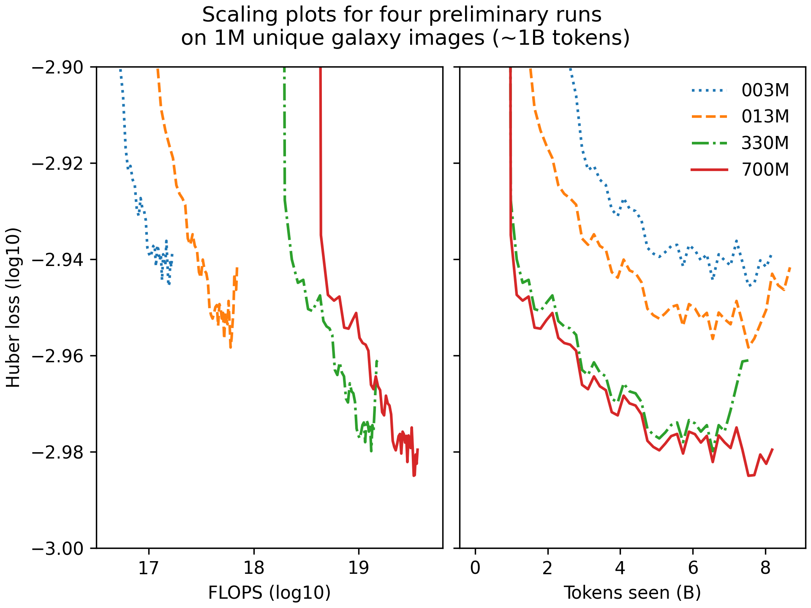

    

# astroPT

A simple repository for training astronomical large observation models. This
repository began its life as Andrej Karpathy's
[nanoGPT](https://github.com/karpathy/nanoGPT), and has been altered so that it
is usable for imagery data.  Within `train.py` you will find a ~300-line
boilerplate training loop and within `model.py` you will find a ~300-line GPT
model definition with an MLP tokeniser and a regressive loss.

Check out the discord for updates: [https://discord.gg/MNEVegvfJq](https://discord.gg/MNEVegvfJq)

## install

Dependencies:

- `pip install -r requirements.txt`

## results

I have been playing around with DESI galaxy png postage stamps 
downloaded from DESI DR8 just to see if my hunch that 
"more galaxy data == more better model" holds. So far this looks to be the
case, and below I show some first results.

Some preliminary results for scaling the model for 1M DESI DR8 galaxies
(around 1B tokens when tokenised via a ViT-like learnt tokeniser):

    

Looking good! Next step: 9M galaxies!

## pretrained weights

Available on [HuggingFace 🤗 here](https://huggingface.co/Smith42/astroPT).

Dataset is also available on [HuggingFace 🔥](https://huggingface.co/datasets/Smith42/galaxies).
