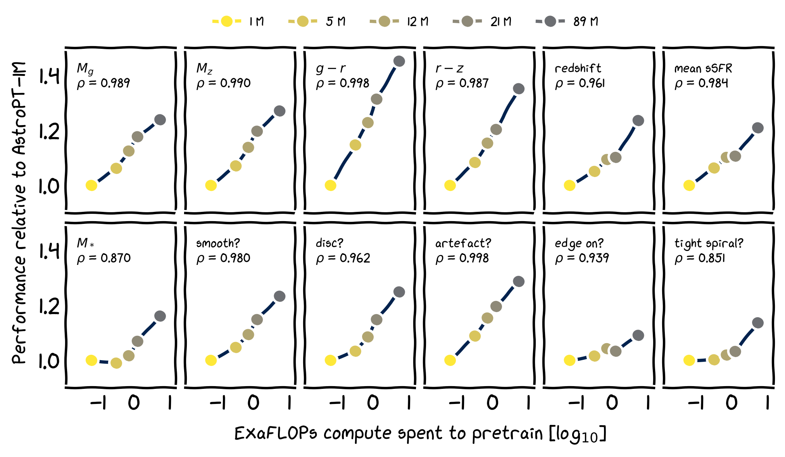

    

# astroPT: a Large Observation Model for astronomy 🔭

Welcome to our simple repository for training astronomical large observation
models. This repository began its life as Andrej Karpathy's
[nanoGPT](https://github.com/karpathy/nanoGPT), and has been altered so that it
is usable for imagery data.  Within `train.py` you will find a ~300-line
boilerplate training loop and within `model.py` you will find a ~300-line GPT
model definition with an MLP tokeniser and a regressive loss.

Check out the [UniverseTBD](https://universetbd.org/) Discord for updates:
[https://discord.gg/MNEVegvfJq](https://discord.gg/MNEVegvfJq)

## install

Dependencies:

- `pip install -r requirements.txt`

## results

AstroPT has been trained on 8.6M galaxy grz band `*.png` postage stamps 
downloaded from DESI-LS DR8 to see if neural scaling laws apply to galaxian
data (in other words, to see if `more galaxy data == more better model`).  
We tried to make the astroPT model as simple as possible so that other
modalities can be easily folded in. We also choose to use a causally trained
autoregressive transformer model as our backbone so that our work can more
easily integrate the wider deep learning FOSS community.

Our pretraining task is feeding in our galaxy images patch-by-patch and
predicting the next patch in our galaxy patch sequence. We follow ViT
and define a patch as a 16 by 16 pixel square, and feed the galaxy patches
in a spiral order:

    

The trained model results are promising -- below we show our full training run
validation losses across a parameter sweep of `{1,5,12,21,89,309,830,2100}M`
trainable parameters:

    

We also test our astroPT models on some scientifically-useful downstream tasks by
taking the models' penultimate layer outputs and finetuning linear probes to
predict emergent physical properties of the galaxies:

    

In the above pic, $M_g$ and $M_z$ are the absolute magnitudes (or brightness at
a fixed distance) of the galaxies, $g - r$ and $r - z$ are the differences
between the observations of different telescope filter bands, redshift is the
distance to the galaxies, sSFR is the total mass of new stars born each year in
the galaxies per total galaxy mass, and $M_{\*}$ is the total mass of stars within
the galaxies. "smooth?", "disc?", "artefact?", "edge on?" and "tight spiral?" are
morphological properties of the galaxies as described by citizen scientists.

The cool thing to take away from these plots is that the surrogate task loss
(predicting the next patch in a sequence of ViT-like galaxy image patches)
is correlated with astronomically "useful" downstream tasks 🤯🚀.

Finally, check out our UMAP projection of astroPT-87M's penultimate layer
outputs of our validation set. We colour each point with an emergent physical
galaxy property described above. The structure suggests that the model has
learnt some knowledge about physics simply from our next-token prediction
pretraining task!

    

## pretrained weights, and full galaxy dataset

We of course release all our model weights checkpointed across our full training runs on [HuggingFace 🤗 here](https://huggingface.co/Smith42/astroPT).

We also release our full dataset and galaxy metadata on [HuggingFace 🔥](https://huggingface.co/datasets/Smith42/galaxies).
