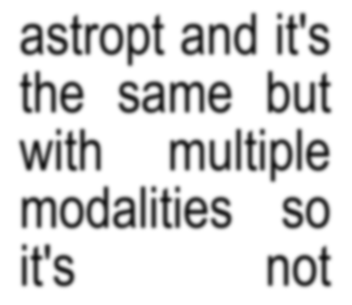

Training single and multimodal AstroPT models
=============================================

This guide describes how to train AstroPT-style Large Observation Models (LOMs) using the provided training scripts.

Overview
--------

We provide two example training scripts in ``scripts/``:

1. ``train.py`` - For training on single-modality data (here galaxy imagery)
2. ``train_multimodal.py`` - For training on multiple modalities (here both galaxy imagery and spectral data)

Of course they can be modified for any modality after altering the tokeniser and position embedding code.
Both scripts support single-GPU and distributed multi-GPU training with Distributed Data Parallel (DDP).

Command-line usage
-----------------

Single GPU
~~~~~~~~~

.. code-block:: bash

   # For single-modality training
   python train.py
   
   # For multi-modality training
   python train_multimodal.py

Distributed Data Parallel (4 GPUs on 1 node)
~~~~~~~~~~~~~~~~~~~~~~~~~~~~~~~~~~~~~~~~~~~~

.. code-block:: bash

   # For single-modality training
   torchrun --standalone --nproc_per_node=4 train.py
   
   # For multi-modality training
   torchrun --standalone --nproc_per_node=4 train_multimodal.py

Distributed Data Parallel (8 GPUs across 2 nodes)
~~~~~~~~~~~~~~~~~~~~~~~~~~~~~~~~~~~~~~~~~~~~~~~~

On the first (master) node:

.. code-block:: bash

   # For either training script
   torchrun --nproc_per_node=8 --nnodes=2 --node_rank=0 --master_addr=123.456.123.456 --master_port=1234 train.py  # or train_multimodal.py

On the worker node:

.. code-block:: bash

   # For either training script
   torchrun --nproc_per_node=8 --nnodes=2 --node_rank=1 --master_addr=123.456.123.456 --master_port=1234 train.py  # or train_multimodal.py

Key differences between scripts
-----------------------------

While ``train.py`` and ``train_multimodal.py`` share most of their code base, there are several important differences:

1. **Modality configuration**

   ``train.py`` configures a single modality for galaxy imagery:
   
   .. code-block:: python

      modalities = [
          ModalityConfig(
              name="images",
              input_size=16 * 16 * n_chan,
              patch_size=16,
              loss_weight=1.0,
              embed_pos=True,
              pos_input_size=1,
          ),
      ]

   ``train_multimodal.py`` configures multiple modalities:
   
   .. code-block:: python

      modalities = [
          ModalityConfig(
              name="images",
              input_size=16 * 16 * n_chan,
              patch_size=16,
              loss_weight=1.0,
              embed_pos=True,
              pos_input_size=1,
          ),
          ModalityConfig(
              name="spectra",
              input_size=256,
              patch_size=256,
              pos_input_size=256,
              loss_weight=0.5,
              embed_pos=False,
          ),
      ]

2. **Dataset handling**

   ``train.py`` can stream Hugging Face datasets (here we use `Smith42/galaxies <https://huggingface.co/datasets/Smith42/galaxies>`_):
   
   .. code-block:: python
      
      # When use_hf=True
      tds_hf = load_dataset("Smith42/galaxies", split="train", streaming=True)
   
   ``train_multimodal.py`` uses local file paths for both modalities:
   
   .. code-block:: python
      
      tds = GalaxyImageDataset(
          paths={"images": "./hsc_matched.txt", "spectra": "./spectra_matched.txt"},
          spiral=spiral,
          transform=transforms,
          modality_registry=modality_registry,
      )

   where ``hsc_matched.txt`` and ``spectra_matched.txt`` are crossmatched text files of the same length with one line per ``FITS`` or ``JPG`` image/spectra.

Configuration options
-------------------

Both scripts support numerous configuration parameters that can be set via command line or configuration files:

Model architecture
~~~~~~~~~~~~~~~~

- ``n_layer``: Number of transformer layers
- ``n_head``: Number of attention heads
- ``n_embd``: Embedding dimension
- ``n_chan``: Number of image channels
- ``block_size``: Maximum sequence length
- ``dropout``: Dropout rate (0.0 recommended for pretraining)
- ``bias``: Whether to use bias in LayerNorm and Linear layers
- ``attn_type``: Attention type ("causal" is standard)

Data parameters
~~~~~~~~~~~~~

- ``gradient_accumulation_steps``: Number of steps to accumulate gradients
- ``batch_size``: Batch size per GPU
- ``spiral``: Process galaxy patches in spiral order (as described in our paper)
- ``image_size``: Size of input images
- ``use_hf``: Use Hugging Face dataset version (``train.py`` only)
- ``stream_hf_dataset``: Stream the galaxies from Hugging Face (``train.py`` only)

Optimiser settings
~~~~~~~~~~~~~~~~

- ``learning_rate``: Maximum learning rate
- ``weight_decay``: Weight decay value
- ``beta1``: Adam beta1
- ``beta2``: Adam beta2
- ``grad_clip``: Gradient clipping value
- ``decay_lr``: Whether to decay learning rate
- ``warmup_iters``: Warmup iterations
- ``lr_decay_iters``: Total iterations for LR decay
- ``min_lr``: Minimum learning rate (learning_rate/10)

Training loop settings
~~~~~~~~~~~~~~~~~~~

- ``max_iters``: Total number of training iterations
- ``eval_interval``: Interval for evaluation
- ``log_interval``: Interval for logging
- ``eval_iters``: Number of batches for evaluation
- ``checkpoint_interval``: Interval for saving checkpoints
- ``eval_only``: Only perform evaluation, no training
- ``always_save_checkpoint``: Always save checkpoints regardless of loss
- ``init_from``: Initialize from scratch or resume training

System settings
~~~~~~~~~~~~~

- ``device``: Device to use (default: "cuda")
- ``dtype``: Data type to use (default: "bfloat16")
- ``compile``: Use PyTorch 2.0 to compile the model
- ``backend``: DDP backend (default: "nccl")
- ``out_dir``: Output directory for logs and checkpoints
- ``log_via_wandb``: Use WandB for logging
- ``log_emissions``: Use CodeCarbon to track emissions

Configuration files
-----------------

Instead of specifying all parameters via command line, you can create a configuration file:

.. code-block:: python
   
   # config/astropt.py
   out_dir = "logs/astropt"
   batch_size = 32
   n_layer = 24
   n_head = 16
   n_embd = 1024

And then pass it to the script:

.. code-block:: bash

   python train.py config/astropt.py  # or train_multimodal.py

You can also override specific parameters from the config file:

.. code-block:: bash

   python train.py config/astropt.py --batch_size=64

We have example config files in ``config``.

Creating custom dataloaders
-------------------------

The AstroPT training pipeline uses the ``GalaxyImageDataset`` class from ``local_datasets.py`` to handle data loading and preprocessing. You can create your own custom dataloader for different modalities by extending this class or creating a similar class that follows the same interface.

Here's a guide to creating a custom dataloader for AstroPT:

1. **Basic structure**

   Your dataloader should inherit from ``torch.utils.data.Dataset`` and implement the following methods:
   
   - ``__init__``: Initialize dataset with paths, transforms, and modality registry
   - ``__len__``: Return the dataset length
   - ``__getitem__``: Return a dictionary of data for each index
   - ``process_modes``: Process data into X and Y tensors for the model

|

2. **Example skeleton**

   .. code-block:: python
      
      class CustomDataset(Dataset):
          def __init__(self, paths, transform=None, modality_registry=None):
              """
              Args:
                  paths (dict): Dictionary of paths for each modality
                  transform (dict, optional): Dictionary of transforms for each modality
                  modality_registry: ModalityRegistry object containing modality configurations
              """
              self.paths = paths
              self.transform = transform
              self.modality_registry = modality_registry
          
          def __len__(self):
              """Return the total number of samples in the dataset"""
              return len(self.paths[list(self.paths.keys())[0]])
          
          def __getitem__(self, idx):
              """Get a single sample from the dataset"""
              # Process each modality and return a dictionary
              result = {}
              
              # Example for image modality
              if "images" in self.paths:
                  # Load and process image data
                  image_data = self.load_image(self.paths["images"][idx])
                  processed_image = self.process_image(image_data)
                  result["images"] = processed_image
                  result["images_positions"] = torch.arange(0, len(processed_image), dtype=torch.long)
              
              # Example for another modality
              if "spectra" in self.paths:
                  # Load and process spectral data
                  spectral_data = self.load_spectrum(self.paths["spectra"][idx])
                  processed_spectrum, wavelengths = self.process_spectrum(spectral_data)
                  result["spectra"] = processed_spectrum
                  result["spectra_positions"] = wavelengths
              
              result["idx"] = idx
              return result
          
          def load_image(self, path):
              """Load image data from path"""
              # Implement loading logic for your image format
              pass
          
          def process_image(self, image_data):
              """Process loaded image data into model-ready format"""
              # Implement processing logic (patching, standardization, etc.)
              pass
          
          def load_spectrum(self, path):
              """Load spectral data from path"""
              # Implement loading logic for your spectral format
              pass
          
          def process_spectrum(self, spectral_data):
              """Process loaded spectral data into model-ready format"""
              # Implement processing logic
              pass
          
          @staticmethod
          def process_modes(x, modality_registry, device, shuf=False):
              """
              Process data dictionary into X and Y tensors for model input/output
              Args:
                  x (dict): Data dictionary from __getitem__
                  modality_registry: ModalityRegistry object
                  device: torch device to move tensors to
                  shuf (bool): Whether to shuffle modality order
              Returns:
                  dict: Dictionary containing 'X' and 'Y' keys with model-ready tensors
              """
              modes = modality_registry.generate_sequence(shuf=shuf)
              
              # Move all tensors to device
              x_on_device = {
                  k: v.to(device) if isinstance(v, torch.Tensor) else v for k, v in x.items()
              }
              
              X = {}
              Y = {}
              
              # Process each modality
              for ii, mode in enumerate(modes):
                  X[mode] = x_on_device[mode]
                  X[f"{mode}_positions"] = x_on_device[f"{mode}_positions"]
                  Y[mode] = x_on_device[mode]
                  
                  # Handle autoregressive prediction (shift by one token)
                  if ii == 0:
                      Y[mode] = Y[mode][:, 1:]
                  if len(modes) == 1:
                      X[mode] = X[mode][:, :-1]
                      X[f"{mode}_positions"] = X[f"{mode}_positions"][:, :-1]
              
              return {"X": X, "Y": Y}

3. **Example: custom spectra dataset**

   .. code-block:: python
      
      class StellarSpectraDataset(Dataset):
          def __init__(self, paths, transform=None, modality_registry=None):
              self.paths = paths
              self.transform = transform
              self.modality_registry = modality_registry
              
              # Read file paths
              if "spectra" in paths and paths["spectra"] is not None:
                  self.spectra_paths = np.genfromtxt(paths["spectra"], delimiter=",", dtype=str)
              else:
                  self.spectra_paths = None
              
              # Set length to the first non-None dataset
              self.dataset_len = len(self.spectra_paths) if self.spectra_paths is not None else 0
          
          def __len__(self):
              return self.dataset_len
          
          def process_spectrum(self, raw_spectrum, wavelength):
              patch_size = self.modality_registry.get_config("spectra").patch_size
              
              # Apply padding to the spectrum to make it divisible by patch_size
              w = raw_spectrum.shape[0]
              pad_w = (patch_size - w % patch_size) % patch_size
              padded_spectrum = F.pad(raw_spectrum, (0, pad_w))
              padded_wl = F.pad(wavelength, (0, pad_w))
              
              # Rearrange into patches
              patch_spectrum = einops.rearrange(
                  padded_spectrum,
                  "(w p) -> (w) (p)",
                  p=patch_size,
              )
              
              patch_wl = einops.rearrange(
                  padded_wl,
                  "(w p) -> (w) (p)",
                  p=patch_size,
              )
              
              # Apply transforms if specified
              if "spectra" in self.transform:
                  patch_spectrum = self.transform["spectra"](patch_spectrum)
              
              return patch_spectrum, patch_wl
          
          def __getitem__(self, idx):
              try:
                  # Load spectral data from FITS file
                  with fits.open(self.spectra_paths[idx]) as hdul:
                      raw_spectrum = hdul[1].data["Flux"].astype(np.float32)
                      wavelength = hdul[1].data["Wave"].astype(np.float32)
                  
                  # Convert to tensor and normalize
                  raw_spectrum = torch.tensor(raw_spectrum).to(torch.bfloat16)
                  wavelength = (torch.tensor(wavelength).to(torch.bfloat16) - 3000) / (10000 - 3000)
                  
                  # Process the spectrum
                  patch_spectrum, patch_wl = self.process_spectrum(raw_spectrum, wavelength)
                  
                  # Check for NaN values
                  if torch.isnan(patch_spectrum).any() or torch.isnan(patch_wl).any():
                      raise ValueError("Found NaNs in spectra, skipping file")
                  
                  return {
                      "spectra": patch_spectrum,
                      "spectra_positions": patch_wl,
                      "idx": idx,
                  }
              
              except Exception as err:
                  print(f"Error processing file {self.spectra_paths[idx]}: {err}")
                  raise
          
          @staticmethod
          def process_modes(x, modality_registry, device, shuf=False):
              modes = modality_registry.generate_sequence(shuf=shuf)
              
              x_on_device = {
                  k: v.to(device) if isinstance(v, torch.Tensor) else v for k, v in x.items()
              }
              
              X = {}
              Y = {}
              for ii, mode in enumerate(modes):
                  X[mode] = x_on_device[mode]
                  X[f"{mode}_positions"] = x_on_device[f"{mode}_positions"]
                  Y[mode] = x_on_device[mode]
                  if ii == 0:
                      Y[mode] = Y[mode][:, 1:]
                  if len(modes) == 1:
                      X[mode] = X[mode][:, :-1]
                      X[f"{mode}_positions"] = X[f"{mode}_positions"][:, :-1]
              
              return {"X": X, "Y": Y}

4. **Integration with training script**

   To use your custom dataloader in the training script:
   
   1. Import your custom dataset class
   2. Replace the GalaxyImageDataset instantiation with your custom dataset
   3. Use the same dataloader configuration as in the original script
   
   .. code-block:: python
      
      from custom_dataloader import CustomDataset
      
      # ...
      
      # Initialize custom dataset
      tds = CustomDataset(
          paths={"modality1": "path1.txt", "modality2": "path2.txt"},
          transform=transforms,
          modality_registry=modality_registry,
      )
      
      # Create DataLoader with the custom dataset
      tdl = iter(
          DataLoader(
              tds,
              batch_size=batch_size,
              num_workers=num_workers,
              pin_memory=True,
          )
      )

Output and monitoring
-------------------

During training, both scripts provide:

- Loss values for training and validation sets
- Visual comparisons of original data and model predictions
- Checkpoint saving based on validation performance
- Optional WandB integration for experiment tracking
- MFU (Model FLOP Utilization) estimates
- Optional carbon emissions tracking

The training progress, model visualizations, and metrics are saved to the specified output directory.
